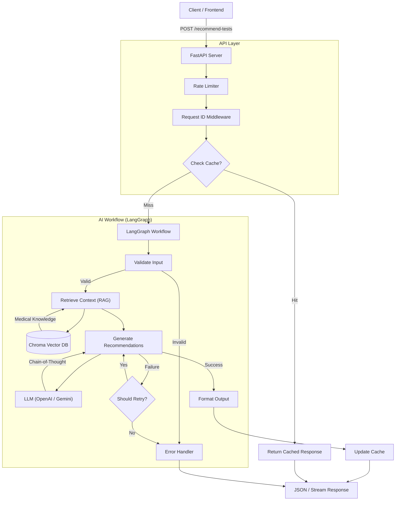

# AI-Powered Lab Test Recommendation System

This project is an advanced AI-driven API designed to recommend follow-up laboratory tests based on a patient's demographics, abnormal test results, and reported symptoms. It leverages a Retrieval-Augmented Generation (RAG) architecture with **LangGraph** orchestration to ensure medically grounded, explainable, and reliable recommendations.

## 🏗️ Architecture

The system is built on a robust architecture designed for scalability, reliability, and observability.



## 🚀 Key Features

### 1. Advanced Prompting Techniques

The core intelligence relies on sophisticated prompt engineering:

- **Chain-of-Thought (CoT)**: The LLM is instructed to think step-by-step (Analyze patterns -> Differential diagnosis -> Select tests -> Justify priority) before generating the final JSON output. This mimics a clinician's reasoning process.
- **Few-Shot Learning**: Examples of "Good" and "Bad" recommendations are embedded in the system prompt to guide the model towards high-quality, standardized outputs.
- **Safety Constraints**: Strict instruction sets ("NEVER diagnose," "NEVER recommend treatment") ensure the AI acts as a decision support tool, prioritizing patient safety.

### 2. Intelligent Caching & Memory Management

- **Identical Query Caching**: An in-memory cache stores results for identical patient profiles (hashed inputs).
- **Memory Leak Prevention**: The cache implements a **Least Recently Used (LRU)** eviction policy with a configurable `max_size` (default: 100). This ensures the application memory usage remains stable over time, preventing memory leaks associated with unbounded cache growth.

### 3. Streaming vs. Normal Response

The API supports two modes of interaction:

- **Normal Response (`/recommend-tests`)**: Returns the complete recommendation object once processing is finished. Best for simple integrations.
- **Streaming Response (`/recommend-tests/stream`)**: Uses **Server-Sent Events (SSE)** to stream the internal reasoning steps (`on_chain_start`, `on_chain_end`) to the client in real-time. This provides transparency and a better user experience during long-running inference.

### 4. Robust Error Handling & Retry Logic

- **Self-Correction**: The LangGraph workflow includes unconditional edges for error checking. If the LLM generates invalid JSON or fails validation rules, the system can trigger a retry automatically.
- **Graceful Degradation**: If an error is unrecoverable, the `error_handler` node ensures a structured error response is returned instead of crashing the server.

### 5. Global Configuration

A centralized `config.yaml` file manages all system settings, enabling easy tuning without code changes:

- LLM Provider & Model selection
- Cache size limits
- Rate limiting rules
- Vector DB paths
- Logging formatting

### 6. LLM Provider Flexibility

The system abstracts the LLM layer, allowing seamless switching between providers via `config.yaml`:

- **OpenAI**: Uses `GPT-4o` (default)
- **Google**: Uses `Gemini` models
  Ideally suited for avoiding vendor lock-in and optimizing costs.

### 7. Observability & Tracing

- **Request ID Tracing**: Every incoming request is assigned a unique UUID (`X-Request-ID`).
- **Threaded Logs**: This ID is propagated through the entire execution stack (Middleware -> LangGraph config -> Logger extras), allowing developers to trace a specific request's journey through all logs, even in concurrent high-load scenarios.

## 🛠️ Setup Instructions

### Prerequisites

- Python 3.10+
- Git

### Installation

1.  **Clone the repository**

    ```bash
    git clone <repository-url>
    cd ai-powered-lab-test-recommendation
    ```

2.  **Create a virtual environment**

    ```bash
    python -m venv .venv
    # Windows
    .venv\Scripts\activate
    # Mac/Linux
    source .venv/bin/activate
    ```

3.  **Install dependencies**

    ```bash
    pip install -r requirements.txt
    ```

4.  **Configuration**
    - Duplicate `.env.example` to `.env` (if available, otherwise create `.env`).
    - Add your API keys:
      ```env
      OPENAI_API_KEY=sk-...
      # or
      GOOGLE_API_KEY=AIza...
      ```

### Running the Application

Start the server using `uvicorn`:

```bash
uvicorn src.app:app --reload
```

The API will be available at `http://localhost:8000`.
Visit `http://localhost:8000/docs` for the interactive Swagger UI.

## 🧪 Testing

The project maintains high code quality through a comprehensive suite of unit and integration tests using `pytest`.

**Tests cover:**

- End-to-end API endpoints (`/recommend-tests`, `/health`)
- Streaming response integrity
- Cache hit/miss logic
- Input validation edge cases (invalid age, gender normalization)
- Rate limiting enforcement

**Run tests:**

```bash
pytest tests/
```

## 🖥️ Frontend Setup (Next.js)

The project includes a modern Next.js frontend application with a beautiful UI built using **Shadcn UI** and **Tailwind CSS**.

### Prerequisites

- Node.js 18+ and npm

### Installation

1.  **Navigate to the web directory**

    ```bash
    cd web
    ```

2.  **Install dependencies**

    ```bash
    npm install
    ```

3.  **Configure environment variables**

    Create a `.env.local` file in the `web` directory:

    ```env
    NEXT_PUBLIC_API_BASE_URL=http://localhost:8000
    ```

    This tells the frontend where to find your backend API.

### Running the Frontend

Start the development server:

```bash
npm run dev
```

The frontend will be available at `http://localhost:3000`.

### Building for Production

To create an optimized production build:

```bash
npm run build
npm start
```

### Frontend Features

- **Real-time Streaming**: Watch the AI reasoning process as it happens
- **Form Validation**: Client-side validation using React Hook Form and Zod
- **Responsive Design**: Works seamlessly on desktop and mobile devices
- **Local Storage**: Saves interaction history for reference
- **Error Handling**: Graceful error displays with retry options

## 📂 Project Structure

```
ai-powered-lab-test-recommendation/
├── src/                    # Backend Python source code
│   ├── app.py             # FastAPI application
│   ├── graph.py           # LangGraph workflow
│   ├── config.py          # Configuration loader
│   └── utils/             # Utility modules
│       ├── cache_manager.py
│       └── chroma_vector_db.py
├── web/                   # Frontend Next.js application
│   ├── app/              # Next.js app directory
│   ├── components/       # React components
│   └── lib/             # Utility functions
├── tests/                # Backend tests
├── data/                 # Vector database and medical knowledge
├── config.yaml          # Global configuration
└── requirements.txt     # Python dependencies
```
